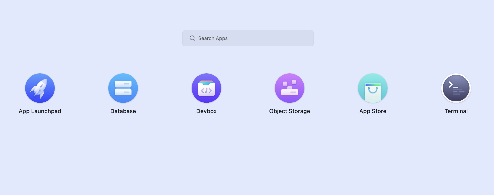
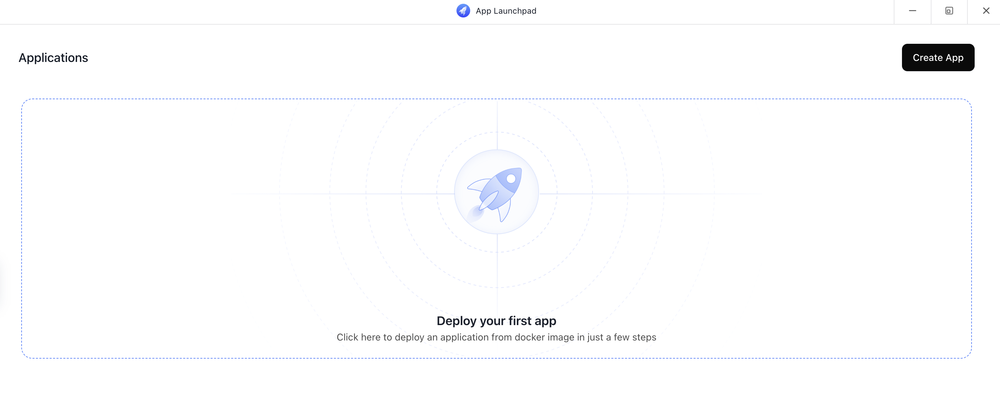
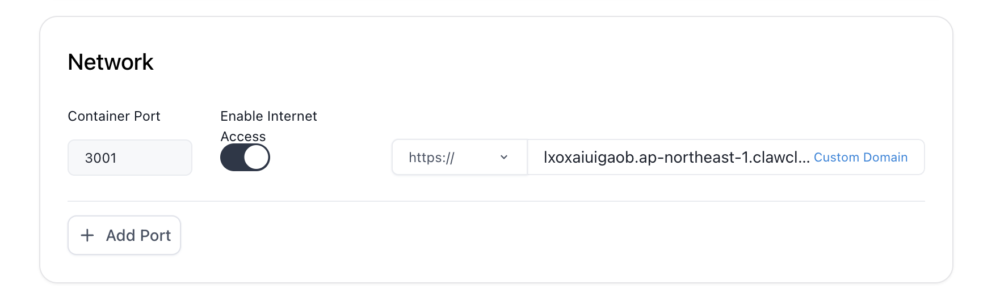
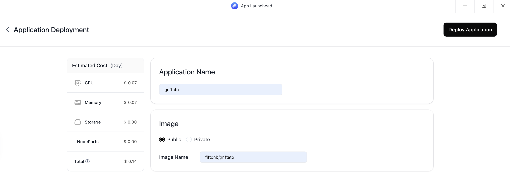

# CLAWCLOUD Run 平台部署Gnftato教程

## 准备工作

如果您还没有注册CLAWCLOUD Run账号，请先[点击此处注册](https://console.run.claw.cloud/signin?link=9IOYACCW0AQ4)

## 部署步骤

1. 注册完成后，进入控制台（建议左上角选美国东部地区）
   
2. 在控制台中选择并点击 **App Launchpad**
   
   

3. 点击 **Create App** 按钮创建新应用
   
   

4. 在创建应用页面填写以下信息：
   - **Application Name**：填写 `gnftato`
   - **Image**：选择 **Public**，然后填入 `fiftonb/gnftato`
   - **Usage**：根据您的实际需求选择合适的配置
   - **Network**：确保开放端口 **3001**
   
   

5. 填写完所有信息后，滑动回页面顶部，点击 **Deploy Application** 按钮完成部署
   
   

6. 等待几分钟，系统将完成应用的部署

## 访问应用

部署成功后，您可以通过分配的URL访问您的Gnftato应用。URL通常显示在应用详情页面。

## 常见问题

如遇到部署问题，请检查：
- 网络连接是否正常
- 镜像名称是否正确
- 端口是否已正确配置

希望本教程对您有所帮助！
